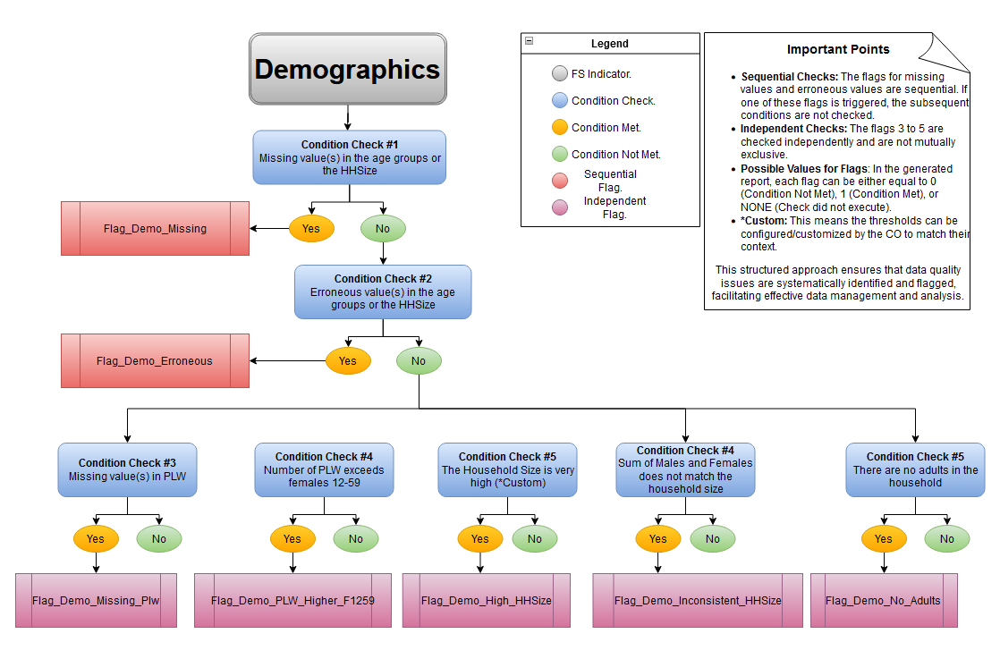
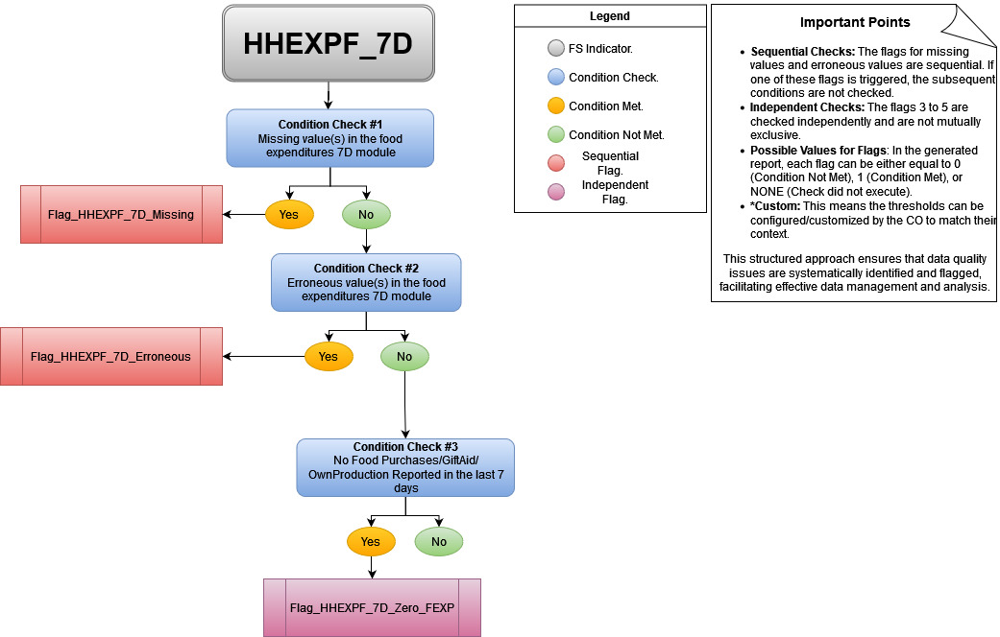
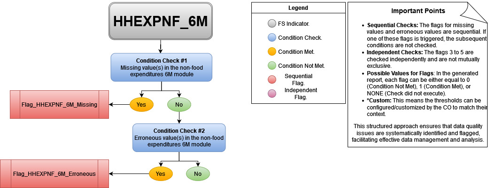
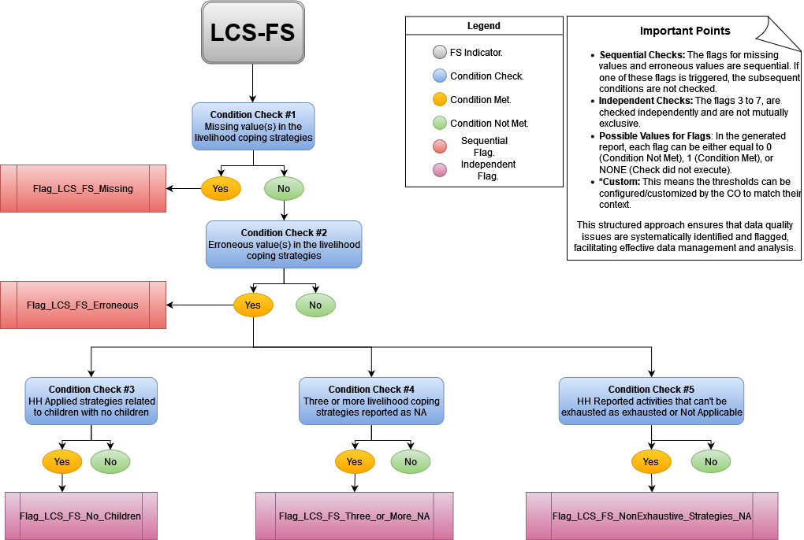
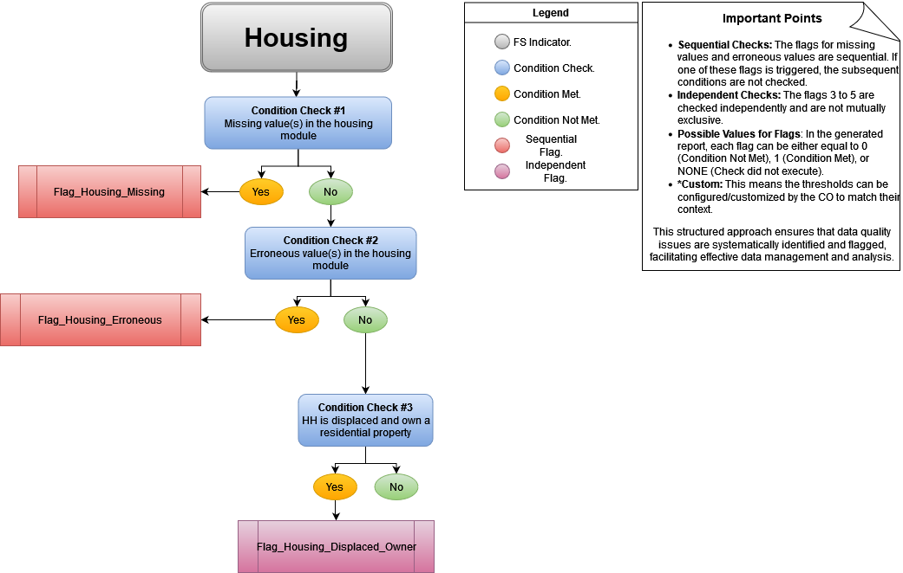
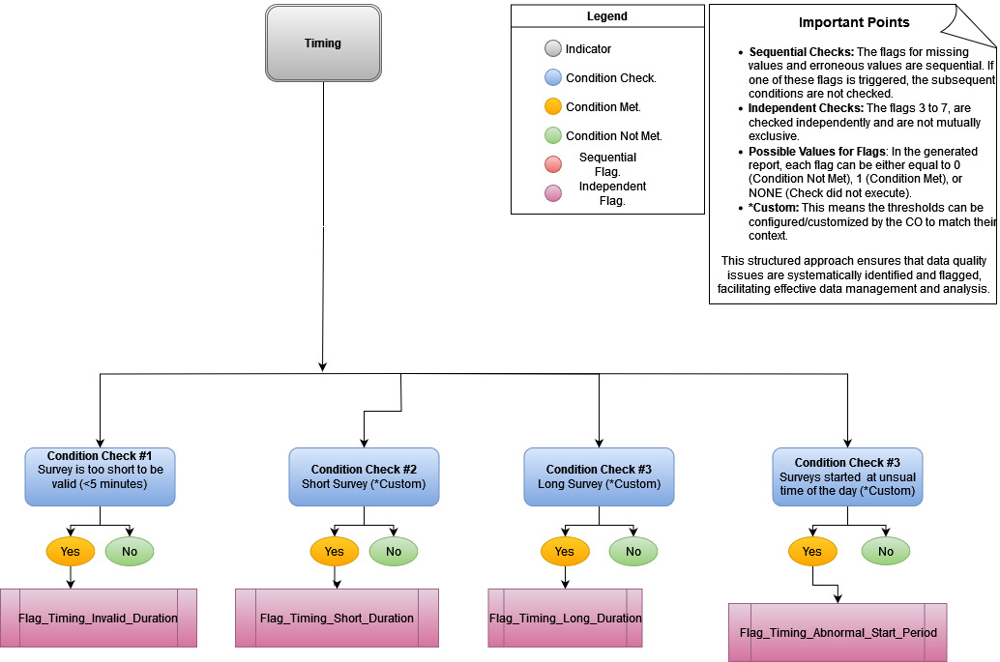

# High Frequency Checks for WFP Needs Assessments

This repository supports WFP Country Offices in checking the quality of the data collected in needs assessment surveys. 

## Features

- **Indicator Modules:** The package includes modules for calculating and validating various indicators commonly used in survey data analysis, such as Food Consumption Score (FCS), Reduced Coping Strategy Index (rCSI), Household Dietary Diversity Score (HDDS), Household Expenditure, Livelihoods Coping Strategies, Housing conditions, and Demographic information.
- **Configurable Checks:** Each indicator module includes a set of configurable checks to identify potential errors or inconsistencies in the data. These checks can be customized based on the specific requirements of the survey or data collection process.
- **Flagging System:** The package implements a flagging system to mark records with potential issues. Flags are generated based on the configured checks, and a narrative description is provided for each flagged record, facilitating review and follow-up.
- **Summary report:** The package can generate a summary report (mastersheet) that consolidates the original data with the calculated indicators and flags. This master sheet can be used for further review and analysis.
- **Data Loading:** The package includes utilities for loading data from various sources, such as Excel files or databases.

## Installation
> Note: This package is still under development and available for testing and contribution. Further guidance on installation and usage will be provided in the near future.

To install the package, follow the steps below:

1. Clone the repository: `git clone https://github.com/WFP-VAM/DataQualityChecks.git`
2. Install the required dependencies: `pip install -r requirements.txt`


## Data Quality checks
The reposity checks data quality for the main food security outcome indicators used in WFP Needs Assessments. 

Issues for each indicators are flagged through a hierarchical structure of **sequential** and **independent** checks.

The checks are organized in the following way:
- **Sequential Checks**: The flags for missing values and erroneous values are sequential. If one of these flags is triggered, the subsequent conditions are not checked. 
  - For categorical variables (e.g. housing options), a value is marked as erroneous if it is not consistent with the WFP Codebook. 
  - For numerical variables (e.g. food groups) a value is marked as erroneous if it is not within the acceptable range.
- **Independent Checks**: If the indicator has no missing or erronous values, custom indipendent checks are executed for each indicator. 
- **Flag Values**: In the generated reports, each flag can be either equal to 0 (Condition Not Met), 1 (Condition Met), or NONE (Check did not execute).

### Demographic module
The following graph shows the decision logic of both sequential and independent checks:



The **indipendent checks** for this indicators are:
- missing values for pregnant and breastfeeding women
- number of pregnant and breastfeeding women exceeds the number of women aged 12-59
- household size is very high (default: 30)
- number of males and females in the household does not match household size
- no adults in the household (default: adult > 15 age)

### Food Consumption Score (FCS)
The following graph shows the decision logic of both sequential and independent checks:


The **indipendent checks** for this indicators are:
- identical values
- low FCS score (default: <10) 
- high FCS score (default: >100)
- low staple consumption (default: <= 4 days)

### Reduced Coping Strategy Index (rCSI)
The following graph shows the decision logic of both sequential and independent checks:


The **indipendent checks** for this indicators are:
- identical values
- poor FCS with no coping (default: rCSI == 0)
- adequate FCS with high coping (default: rCSI > 50)
- adults reduced their meail intake so children could eat in households with no children

### Food Expenditures

The following graph shows the decision logic of both sequential and independent checks for food expenditure:



The **sequential checks** for this indicators are customizibile according to the country context. 

The **indipendent checks** for this indicators are:
- no expenditure on food report nor own production

### Non-food Expenditures

The following graphs shows the decision logic of both sequential and independent checks for food expenditure:

#### 10month recall period


#### 6-month recall period


The **sequential checks** for this indicators are customizibile according to the country context. 

### LCS 

The following graph shows the decision logic of both sequential and independent checks for 



The **indipendent checks** for this indicators are:
- household reported applying strategies related to children when there are no children in the house
- three or more coping strategy was reported as NA
- houshold reported as not applicable or exhausted strategies that cannot be exhausted or not applicable (e.g. begging or illecit activities)

The **independent checks** for this indicators are customizibile according to the country context (i.e. choosing the coping strategies)

### Housing

The following graph shows the decision logic of both sequential and independent checks for 



The **indipendent checks** for this indicators are:
- a displaced household reports living in a property they own

### Timing

The following graph shows the decision logic of both sequential and independent checks for 



The **indipendent checks** for this indicators are:
- survey has an invalid durationg (default: <5 minutes)
- survey is too short (default: <10 minutes)
- survey is too long (default: >120 minutes)
- survey started during an unusual time of the day (e.g. during the night) (default: survey started between 7pm and 7am)

The **independent checks** for this indicators are customizibile according to the country context (i.e. choosing the unusual times of the day)


### Household Diet Diversity Score (HDDS)

Indicator check coming soon

### HHS

Indicator check coming soon

## Contextualization

Some data quality checks can be contextualized based on the country context (e.g. abnormally high/low food expenditure). WFP Country Offices can insert the custom thresholds for the customizable indicators in the configuration files contained in the ```config``` folder. 

## Contributing

Contributions to this project are welcome. If you find any issues or have suggestions for improvements, please open an issue or submit a pull request.

## Authors

- [Ali Assi](https://github.com/AssiALi16)
- [Alessandra Gherardelli](https://github.com/AlexGherardelli)

## License

This project is licensed under the Affero GPL v3.0 license.
